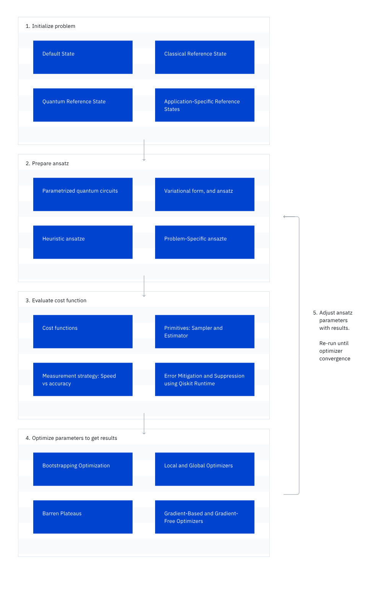

# Algoritmos Variacionales

Los **algoritmos variacionales** son una familia de algoritmos híbridos en computación cuántica, diseñados para combinar y optimizar componentes modulares en función de los avances en algoritmos, software y hardware. Los elementos fundamentales de estos algoritmos incluyen:

1. **Función de costo**: Describe un problema específico mediante un conjunto de parámetros.
2. **Ansatz**: Expresa el espacio de búsqueda usando dichos parámetros.
3. **Optimizador**: Explora el espacio de búsqueda iterativamente hasta encontrar una solución óptima.

Cada iteración consiste en evaluar la función de costo con los parámetros actuales y seleccionar los parámetros para la siguiente iteración hasta converger en una solución óptima. Estos algoritmos son híbridos porque las funciones de costo se evalúan en recursos cuánticos y se optimizan mediante recursos clásicos.

## Pasos de un Algoritmo Variacional

### 1. Inicializar el Problema
Los algoritmos variacionales inician configurando la computadora cuántica en un estado base $|0\rangle$. Luego, este estado se transforma en un estado deseado (no parametrizado), que llamaremos **estado de referencia** $|\rho\rangle$.

Esta transformación se representa mediante la aplicación de un **operador unitario de referencia** $U_R$ sobre el estado base, de modo que:
$U_R |0\rangle = |\rho\rangle$

### 2. Preparar el Ansatz
Para comenzar a optimizar iterativamente desde el estado base $|0\rangle$ hacia el estado objetivo $|\psi(\vec{\theta})\rangle$, se define una **forma variacional** $U_V(\vec{\theta})$, que representa una colección de estados parametrizados que el algoritmo explorará.

La combinación del estado de referencia y la forma variacional se denomina **ansatz**, tal que:
$U_A(\vec{\theta}) := U_V(\vec{\theta}) U_R$
El ansatz adopta la forma de un circuito cuántico parametrizado, capaz de llevar el estado base $|0\rangle$ al estado objetivo $|\psi(\vec{\theta})\rangle$.

El proceso se representa como:
$|0\rangle \rightarrow U_R |0\rangle = |\rho\rangle \rightarrow U_V(\vec{\theta}) U_A(\vec{\theta}) |0\rangle = U_V(\vec{\theta}) U_R |0\rangle = U_V(\vec{\theta}) |\rho\rangle = |\psi(\vec{\theta})\rangle$

### 3. Evaluar la Función de Costo
El problema se codifica en una **función de costo** $C(\vec{\theta})$ como una combinación lineal de operadores de Pauli, que se ejecuta en un sistema cuántico. Esta función puede describir información de sistemas físicos, como energía o spin, o problemas no físicos.

Para abordar el ruido en la evaluación de la función de costo, se pueden utilizar herramientas de **supresión y mitigación de errores**.

### 4. Optimizar los Parámetros
Las evaluaciones obtenidas se envían a una computadora clásica, donde un optimizador clásico analiza los resultados y elige el próximo conjunto de valores para los parámetros variacionales. Si se cuenta con una solución óptima previa, esta puede establecerse como punto inicial $\vec{\theta}_0$ para agilizar el proceso de optimización. Usar un estado inicial $\psi(\vec{\theta}_0)\rangle$ puede ayudar a encontrar una solución válida de manera más eficiente.

### 5. Ajustar los Parámetros del Ansatz y Repetir
El proceso se repite hasta que se cumplan los criterios de finalización del optimizador clásico, devolviendo un conjunto de parámetros óptimos $\vec{\theta}^* \$. El estado solución propuesto para nuestro problema será:

TODO: Solucionar
$\[
|\psi(\vec{\theta}^*)\rangle = U_A(\vec{\theta}^*) |0\rangle
\]$

## Teorema Variacional

El objetivo común de los algoritmos variacionales es encontrar el estado cuántico con el valor más bajo o más alto del espectro de un observable dado. La base de este método se encuentra en el **teorema variacional de la mecánica cuántica**.

### Intuición Matemática para Energía y Estados Base

En mecánica cuántica, la **energía** se representa como un observable cuántico, comúnmente el **Hamiltoniano** $\hat{H}$. Su descomposición espectral es:

$\hat{H} = \sum_{k=0}^{N-1} \lambda_k |\phi_k\rangle \langle \phi_k|$

donde:
- $N$: dimensionalidad del espacio de estados,
- $\lambda_k$: $k$-ésimo eigenvalor o nivel de energía,
- $|\phi_k\rangle$: eigenestado correspondiente.

La energía esperada de un sistema en el estado normalizado $|\psi\rangle$ será:

$\langle \psi | \hat{H} | \psi \rangle = \sum_{k=0}^{N-1} \lambda_k |\langle \psi | \phi_k \rangle|^2$

Como $\lambda_0 \leq \lambda_k, \forall k$, se obtiene:

$\langle \psi | \hat{H} | \psi \rangle \geq \lambda_0$

Para cualquier estado cuántico válido $|\psi\rangle$, se pueden considerar estados parametrizados $|\psi(\vec{\theta})\rangle$ que dependen de un vector de parámetros $vec{\theta}$. Así, para una función de costo $C(\vec{\theta}) := \langle \psi(\vec{\theta}) | \hat{H} | \psi(\vec{\theta}) \rangle$, el mínimo de esta función siempre satisface:

$min_{\vec{\theta}} C(\vec{\theta}) = \min_{\vec{\theta}} \langle \psi(\vec{\theta}) | \hat{H} | \psi(\vec{\theta}) \rangle \geq \lambda_0$
